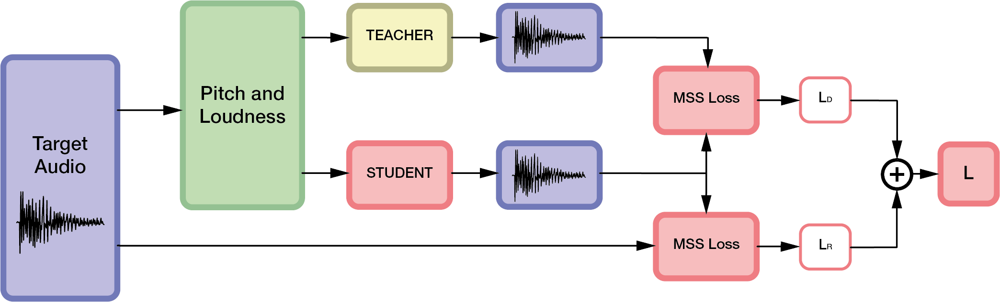

______________________________________________________________________

<div align="center">

# Knowledge Distillation of neural models for audio signal generation
<a href="https://pytorch.org/get-started/locally/"></a>
<a href="https://pytorchlightning.ai/"></a>
<a href="https://hydra.cc/"></a>
<a href="https://magenta.tensorflow.org/ddsp"></a>

<center>

</center>
<br>

</div>

## Description
This repository is part of my master's degreee thesis.
Main goal of the thesis is to analyze the effects of Knowledge Distillation (KD) on different DDSP decoders for audio signal generation.

Three teacher models, called "*large*" models (4.5M parameters), have been implemented, each corresponding to a DDSP decoder controlling a Harmonic-plus-Noise synthesizer: 
- GRUdecoder-L: Gated Recurrent Unit (GRU)
- TCNdecoder-L: Temporal Convolution Network (TCN)
- S4decoder-L: [Structured State Space Sequence](https://github.com/HazyResearch/state-spaces/tree/main) (S4)

Two types of experiments were performed in order to analyze the effectiveness of the Knowledge Distillation, both when the student corresponds to a reduced version of the teacher, and when it corresponds to a model with different architecture.

**Student with same architecture as teacher**:
- "*medium*" (400K parameters): GRUdecoder-M, TCNdecoder-M, S4decoder-M
- "*small*" (40K parameters): GRUdecoder-S, TCNdecoder-S, S4decoder-S

**Student with different architecture:**
- [DDX7](https://github.com/fcaspe/ddx7/tree/main) (400K parameters)


## Installation

#### Conda + Pip

```bash
# Clone project
git clone git@github.com:gregogiudici/Knowledge-Distillation_DDSP-Decoder.git
cd Knowledge-Distillation_DDSP-Decoder

# Create conda environment
conda create -n myenv python=3.9
conda activate myenv
conda install pytorch==1.13.1 torchaudio==0.13.1 pytorch-cuda=11.6 -c pytorch -c nvidia
# Some care may be needed to make compatible the library versions of torch, torchaudio, etc

# Install requirements
pip install -r requirements.txt

# For S4decoder: compile CUDA extension for cauchy multiplication 
# (not required but recommended)
cd extensions/cauchy/ 
python setup.py install
```
#### ATTENTION:
Remember to <ins>configure</ins> the development environment (**.env**) file: this file is used to pass environment variables for the proper operation of this project.

## Dataset generation

We used the [URMP](https://labsites.rochester.edu/air/projects/URMP.html) dataset to train and test the models.
Additional test files can be aggregated and used for resynthesis tasks.
Please check the `dataset` directory for advanced options to process and build a dataset.

**Quick start** - will extract and process violin, flute, and trumpet data using [`torchcrepe`](https://github.com/maxrmorrison/torchcrepe).

```bash
cd dataset
python create_data.py urmp.source_folder=/path/to/URMP/Dataset
```

## Quick-start
### Train model without Knowledge Distillation

Train model with default configuration

```bash
# Train with accelerator=auto (CPU, GPU, DDP, etc)
python src/train.py

# Train on CPU
python src/train.py trainer=cpu

# Train on GPU
python src/train.py trainer=gpu
```
Train different model (sample-rate=16kHz & frame-rate=250Hz)
```bash
# Train GRUdecoder (default) with Flute (default)
# dataset: sr=16kHz, fr=250
python src/train.py #model=gru/large_gru_decoder

# Train TCNdecoder with Flute (default)
python src/train.py model=tcn/medium_tcn_decoder

# Train DDX7 with Flute (default)
python src/train.py model=ddx7/tcnres_f0ld_fmflt.yaml
```
Train model with different instrument (sample-rate=16kHz & frame-rate=250Hz)

```bash
# Train GRUdecoder (default) with Flute (default)
# dataset: sr=16kHz, fr=250
python src/train.py #data=flute_16000_250

# Train GRUdecoder (default) with Violin
python src/train.py data=violin_16000_250 

# Train GRUdecoder (default) with Trumpet
python src/train.py data=trumpet_16000_250
```

You can override any parameter from command-line like this

```bash
python src/train.py trainer.max_epochs=5000 data.batch_size=64 data.instrument=violin_16000_250 
```

## Knowledge Distillation: experiments
Choose experiment configuration from [configs/experiment/](configs/experiment/)

### 1. Train TEACHER 

```bash
# Experiment: GRUdecoder-L
#       dimension: large
#       model: GRUdecoder
#       instrument: flute
python src/train.py experiment=gru/large_gru_flute
```
### 2. Add TEACHER checkpoint to your .env file
This is necessary for the Knowledge Distillation since you have to indicate where the pre-trained teacher model is located.
```bash
LARGE_GRU_FLUTE_16000_250="${ROOT}/logs/large/runs/1999-12-31_00-00-00/checkpoints/epoch_000.ckpt"

```

### 3. Train STUDENT without Knowledge Distillation
```bash
# Experiment: GRUdecoder-M
#       dimension: medium
#       model: GRUdecoder
#       instrument: flute
python src/train.py experiment=gru/medium_gru_flute

# Experiment: DDX7
#       model: DDX7 with fmflt patch
#       instrument: flute
python src/train.py experiment=ddx7/ddx7_fmflt_flute
```
### 4. Train STUDENT with Knowledge Distillation
```bash
# Experiment: KD-GRUdecoder-M
#       dimension: medium
#       model: GRUdecoder
#       instrument: flute
python src/distillation.py experiment=kd/large2medium/gru2gru_flute

# Experiment: KD-DDX7 (GRU)
#       model: DDX7 with fmflt patch
#       instrument: flute
python src/distillation.py experiment=kd/hpn2ddx7/gru2ddx7_flute
```